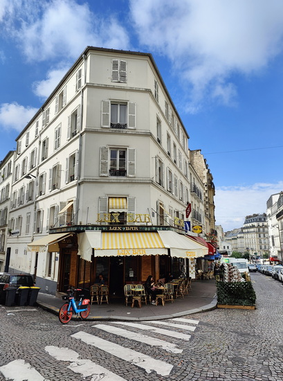
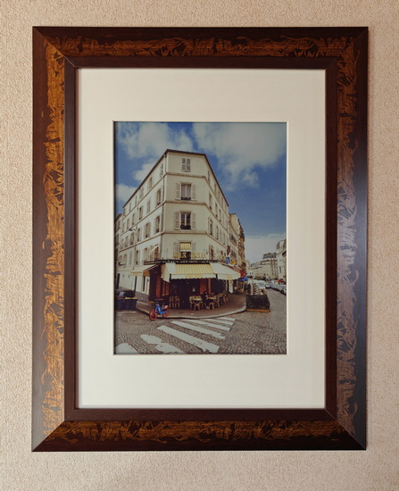
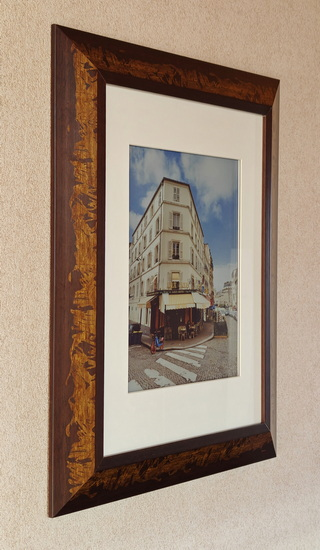
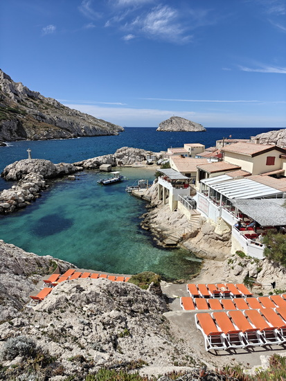
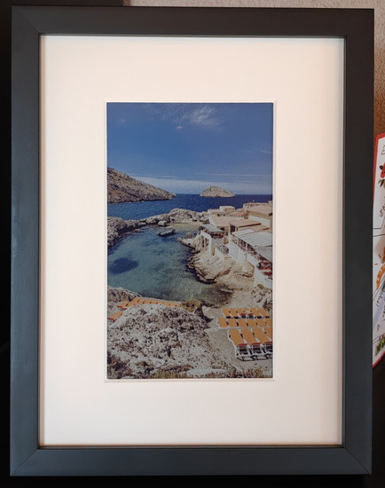
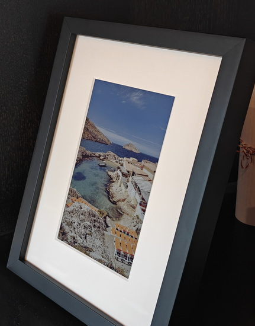

# 📖 Table of contents

- [📖 Table of contents](#-table-of-contents)
- [✨ Features](#-features)
- [📖 Background](#-background)
- [📖 Example pictures](#-example-pictures)
  - [BLOOMIN8 13,3" frame](#bloomin8-133-frame)
  - [paperlesspaper OpenPaper 7 frame](#paperlesspaper-openpaper-7-frame)
- [📦 Installation methods](#-installation-methods)
  - [Linux command line (tried on Debian)](#linux-command-line-tried-on-debian)
    - [🧩 Requirements](#-requirements)
    - [Debian: Install system dependencies for node-canvas](#debian-install-system-dependencies-for-node-canvas)
    - [Install Node.js \& npm](#install-nodejs--npm)
    - [Obtain repository](#obtain-repository)
      - [Option A: Clone using Git](#option-a-clone-using-git)
      - [Option B: Download as ZIP](#option-b-download-as-zip)
    - [Install dependencies](#install-dependencies)
    - [Run as a systemd service](#run-as-a-systemd-service)
  - [Docker container](#docker-container)
    - [🧩 Requirements](#-requirements-1)
    - [Build image](#build-image)
    - [Run container](#run-container)
- [💻 Usage](#-usage)
  - [Health endpoint](#health-endpoint)
  - [Image optimization using JSON](#image-optimization-using-json)
  - [Image optimization using direct POST image upload](#image-optimization-using-direct-post-image-upload)
  - [Possible parameters](#possible-parameters)
  - [bash example](#bash-example)
- [My settings for BLOOMIN8 and paperlesspaper](#my-settings-for-bloomin8-and-paperlesspaper)
  - [BLOOMIN8 (portrait orientation)](#bloomin8-portrait-orientation)
  - [paperlesspaper (portrait orientation)](#paperlesspaper-portrait-orientation)
- [🚫 Limitations](#-limitations)
- [🛠️ Development \& status](#️-development--status)
- [🐞 Report a bug](#-report-a-bug)
- [🙏 Note](#-note)

# ✨ Features

Rudimentary nodeJS service for optimizing photos for Spectra 6 E-Ink displays.

- nodeJS service
- Provides two REST API endpoints: /health and /optimize
- Returns an image optimized for Spectra 6 E-Ink display
- Offers several settings options for customization to suit your preferences
- Supports JSON or HTML form input
- Supports image input using a URL or direct POST upload of an image file

# 📖 Background

I purchased a [**BLOOMIN8 e-ink picture frame**](https://www.bloomin8.com/) with a Spectra 6 E-Ink display to display photographs. For this purpose, I use my [Home Assistant Custom Component](https://github.com/fwmone/bloomin8_pull), which allows the frame to periodically fetch new images.

While this setup worked reliably, the visual results were disappointing: images appeared too dark, lacked color depth, and often looked flat. In addition, correct scaling and cropping proved to be essential to achieve a pleasing composition on the display.

Later, I also bought a [**paperlesspaper OpenPaper 7**](https://paperlesspaper.de/), which is likewise based on Spectra 6 but uses different hardware and firmware. For this frame, the excellent [**EPD Optimize**](https://github.com/Utzel-Butzel/epdoptimize) project exists. EPD Optimize is essential for achieving acceptable image quality on the paperlesspaper frame. However, EPD Optimize does not work well with the BLOOMIN8 frame when using its [standard image upload endpoint](https://bloomin8.readme.io/reference/post_upload-1). It might work with the BLOOMIN8 dithered image data upload endpoint, but I have not tested this yet.

For paperlesspaper frames, I additionally created a [Home Assistant Custom Component](https://github.com/fwmone/paperlesspaper_push) that enables pushing new images to the frame and retrieving telemetry data.

As a result, I implemented this Node.js service to optimize photos for both types of picture frames. After extensive experimentation, I arrived at a setup and parameter combination that works best for my use case. Of course, all settings can be adjusted to match personal preferences.

# 📖 Example pictures

## BLOOMIN8 13,3" frame

- The first image shows the original, unoptimized photo.
- The following images show my BLOOMIN8 13.3" frame mounted in a custom wooden frame with UV70 museum glass (the device is originally shipped with an aluminum frame without glass), photographed in daylight after optimization.
- Optimization parameters used:

```ini
outW = 1200  
outH = 1600  
fit = cover  
format = jpeg  
gamma = 0.85  
saturation = 1.15  
lift = 13  
liftThreshold = 90  
epd_optimize = 0  
color_optimize = 1
```

- Colors are not perfectly accurate and appear slightly muted, but in real life the result looks surprisingly photo-like in most lighting conditions. The UV70 museum glass makes a clearly visible difference.





## paperlesspaper OpenPaper 7 frame

- The first image again shows the original, unoptimized photo.
- The following images show my paperlesspaper OpenPaper 7 in its standard black wooden frame with UV70 museum glass, photographed in daylight. The frame is mounted on an [EaselMate frame stand](https://www.fletcher-terry.com/frame-joining-cutting-hanging-automation-1/albin-hanging-display-products).
- Optimization parameters used:

```json
{
  "outW": 480,
  "outH": 800,
  "format": "png",
  "epd_optimize": 1,
  "color_optimize": 0,
  "fit": "cover"
}
```

- As with the BLOOMIN8 frame, colors are not perfectly accurate and remain slightly muted. However, I personally prefer the real-world results on the OpenPaper 7 even more. EPD Optimize appears to handle color reproduction more gracefully than BLOOMIN8’s internal processing.
- Without EPD Optimize (or the paperlesspaper web UI / app), image quality on this frame is, quite frankly, unusable.





# 📦 Installation methods

## Linux command line (tried on Debian)

### 🧩 Requirements

- Node.js (recommended: current LTS version)
- npm (comes with Node.js; automatically installed with LTS)
- node-canvas
- Cairo and Pango (Linux Debian)
- Optional (recommended): git to clone the repository

Note: If you are unsure which Node version you have, run node -v and npm -v in the terminal.


### Debian: Install system dependencies for node-canvas

```bash
sudo apt update
sudo apt install -y \
  build-essential \
  libcairo2-dev \
  libpango1.0-dev \
  libjpeg-dev \
  libgif-dev \
  librsvg2-dev \
  libpng-dev
```

This allows ```npm install canvas``` to build the native bindings.

### Install Node.js & npm
**Recommended: Node.js LTS**
Install the LTS (Long Term Support) version of Node.js. This will usually give you the most stress-free experience.
- Windows / macOS: Use the installer from the official Node.js website.
- Linux: Depending on your distribution, use either the package manager or (often the cleanest option) NodeSource / nvm.

Check after installation:

```bash
node -v
npm -v
```

If both commands output version numbers, everything is fine.

### Obtain repository
#### Option A: Clone using Git

```bash
git clone https://github.com/fwmone/eink-optimize.git
cd eink-optimize
```

#### Option B: Download as ZIP

- Download ZIP, unzip
- Switch terminal to the unzipped project folder

### Install dependencies
In the project folder (where package.json is located):

```bash
npm install
```

This installs all dependencies in the node_modules/ folder.

Start test

In the project folder (where package.json is located):

```bash
node server.js
```

Then:

```bash
curl -s http://localhost:3030/health
```

And a test optimize (with any image URL accessible from the Debian server):

```bash
curl -X POST http://localhost:3030/optimize \
  -H "Content-Type: application/json" \
  -d '{"image_url":"https://example.com/test.jpg","mode":"spectra6","width":1200,"height":1600}' \
  --output out.png
```

### Run as a systemd service

File ```/etc/systemd/system/eink-optimize.service```:

```
[Unit]
Description=E-Ink EPD Optimize
After=network.target

[Service]
Type=simple
WorkingDirectory=/home/<USER>/eink-optimize
ExecStart=/usr/bin/node /home/<USER>/eink-optimize/server.js
Restart=on-failure
RestartSec=2
Environment=PORT=3030

# optional hardening
NoNewPrivileges=true
PrivateTmp=true
ProtectSystem=strict
ProtectHome=false

[Install]
WantedBy=multi-user.target
```

Replace ```/home/<USER>/eink-optimize``` with the directory where package.json is located. 

Then:

```bash
sudo systemctl daemon-reload
sudo systemctl enable --now eink-optimize
sudo systemctl status eink-optimize
```

## Docker container

You can also use `eink optimize` entirely via Docker without having to install Node.js and npm locally (Thanks @[jetpacktuxedo](https://github.com/fwmone/eink-optimize/commits?author=jetpacktuxedo) for adding the Dockerfile).

### 🧩 Requirements

- Docker Desktop (Windows/macOS) or Docker Engine (Linux)

### Build image

In the root directory of this repository:

```bash
docker build -t eink-optimize .
```

### Run container

```bash
docker run --rm eink-optimize
```

# 💻 Usage

## Health endpoint

The best way to call it is via cURL:

```bash
curl -X GET http://localhost:3030/health
```

It should return:

```json
{"ok":true}
```

## Image optimization using JSON

```bash
curl -X POST http://localhost:3030/optimize \
-H "Content-Type: application/json" \
-d '{"imageUrl":"<URL_TO_BE_OPTIMIZED_IMAGE>","outW":1200,"outH":1600,"format":"jpeg", "epd_optimize": 0, "color_optimize": 1, "fit": "cover", "gamma": 0.88, "saturation": 1.1}' \
--output out.jpg
```

The optimized image should then appear in the **out.jpg** file.

## Image optimization using direct POST image upload

```bash
curl -X POST "http://localhost:3030/optimize" \
  -F "image=@./input.jpg" \
  -F "outW=1200" \
  -F "outH=1600" \
  -F "fit=contain" \
  -F "format=jpeg" \
  --output out.jpg
```

The optimized image should then appear in the **out.jpg** file.

## Possible parameters

Possible parameters are:

|key|explanation|
|----------|---------|
|imageUrl|URL of the image to be optimized|
|image|POST image HTML form field containing the binary image data - not available in JSON mode|
|outW|Width of the optimized image|
|outH|Height of the optimized image|
|fit|cover = fill completely, crop edges if necessary, or contain = reduce size, with background color|
|format|jpeg or png. BLOOMIN8 can only handle jpeg|
|gamma|Gamma correction, e.g. 0.9|
|saturation|Color saturation, e.g. 1.1|
|lift|Elevation of deep colors, values between 0-15 work well|
|liftThreshold|Which color values are considered low? The higher the value, the brighter the tones are lifted; values between 90 and 120 are recommended|
|epd_optimize|Uses EPDOptimize for paperlesspaper picture frames. Does not work well with BLOOMIN8.|
|color_optimize|Color optimization, i.e., gamma, saturation, lift|

## bash example

Here's a quick shell one-liner to process an entire directory of photos into another directory (Thanks @[jetpacktuxedo](https://github.com/fwmone/eink-optimize/commits?author=jetpacktuxedo)):

```bash
for FILE in *; do echo $FILE; curl -X POST http://localhost:3030/optimize -F "image=@$FILE" -F "outW=1600" -F "outH=1200" -F "fit=contain" -F "format=jpeg" -F "color_optimize=1" -F "liftThreshold=90" -F "lift=13" -F "saturation=1.15" -F "gamma=0.85" -F "epd_optimize=0" --output ../screen-optimized/$FILE; done
```

# My settings for BLOOMIN8 and paperlesspaper

I use both frames to show all kind of photos - portraits, wide-angled landscape views, city photography, available light settings and so on. In my case, I'm quite happy with these settings:

## BLOOMIN8 (portrait orientation)
```json
{"outW":1200,"outH":1600,"format":"jpeg", "epd_optimize": 0, "color_optimize": 1, "fit":"cover", "gamma": 0.85, "saturation": 1.15, "lift": 13, "liftThreshold": 90}
```

## paperlesspaper (portrait orientation)
```json
{"outW":480,"outH":800,"format":"png", "epd_optimize": 1, "color_optimize": 0, "fit":"cover"}
```


# 🚫 Limitations

The script is very rudimentary and was developed quickly and dirty—it serves its purpose. I welcome any optimizations or ideas.

# 🛠️ Development & status

This integration is currently under active development. 
Feedback, bug reports, and pull requests are welcome.

# 🐞 Report a bug

Please use the issue tracker on GitHub:

👉 https://github.com/fwmone/eink-optimize/issues

# 🙏 Note

This integration has no official connection to the manufacturer of BLOOMIN8 or paperlesspaper.